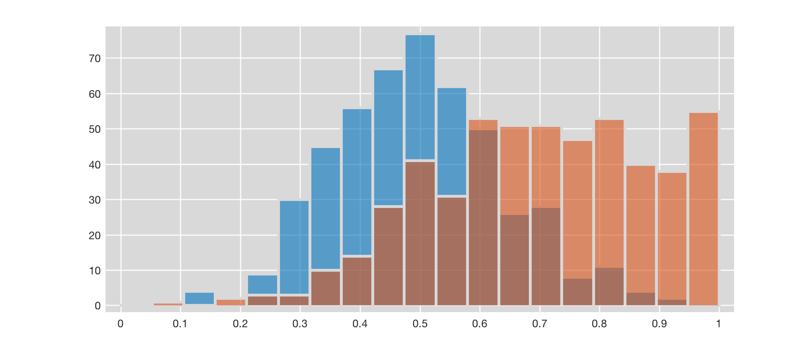
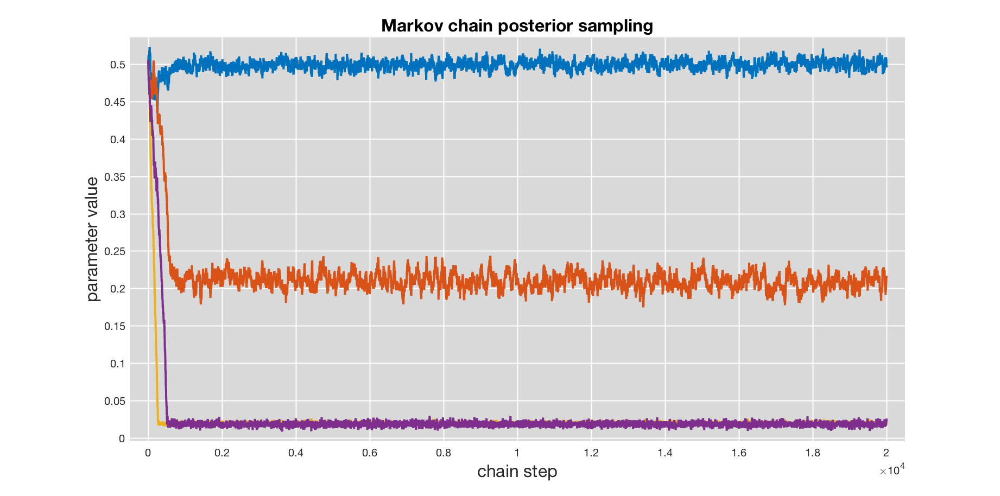

# CRuMBCaKe


## Contents
* [What is it?](#what-is-it)
* [What is it good for?](#what-is-it-good-for)
  * [Example 1](#an-example---obscured-treatment-effects)
  * [Example 2](#another-example---estimating-interaction-effects-on-variance)
* [Getting started with CRuMBCaKe](#getting-started)
  * [Installation](#installation-in-matlab)
  * [Data formatting](#input-data-formatting)
  * [Example using simulated data](#example-using-simulated-data)
    * [Simulate data](#simulate-data)
    * [Fitting a model](#fitting-a-model)
    * [Model diagnostics](#model-diagnostics)
* [Limited functionality](#limited-functionality-note)
* [Contributors](#contributors)
* [License](#license)

## What is it?
CRuMBCaKe is a MATLAB package for Bayesian linear modeling.  It stands for **C**ensored **R**egression **M**odeling using **B**ayesian methods with **C**onditional Heteros**k**edasticity.  Currently, it supports modeling with Normal, ~~Binomial~~, and "heavy-tailed" Student's *t*-distributions.

*Note: This package requires MATLAB's Statistics Toolbox (for pre-R2015a releases) or the Statistics and Machine Learning Toolbox (for post-2014b releases). CRuMBCaKe will not work without it.*


## What is it good for?
CRuMBCaKe does vanilla linear modeling right out of the box, *plus* it handles cases of **data censoring** (where measurements are bounded on one or both ends) and **conditional heteroskedasticity** (where variance is a function of one or more independent variables) when you tell it to.  This makes it great for situations in which measurement dynamic range is smaller than the range of the data - so-called "data censoring."  It's also great for situations where we are specifically interested in modeling the effects of different factors on variance, in addition to the mean.  

CRuMBCaKe takes a Bayesian approach to model fitting, using a Markov Chain Monte Carlo process to sample from posterior distributions of model parameters (via slice sampling).  This has a number of advantages over traditional Maximum Likelihood Estimation methods, like being able to incorporate prior information on parameters into the model and the ability to construct conditional posterior distributions.  Users unfamiliar with the process of Bayesian estimation are encouraged to check out John Kruschke's [Doing Bayesian Data Analysis](https://www.amazon.com/Doing-Bayesian-Data-Analysis-Second/dp/0124058884) for a gentle introduction, or Adrew Gelman's classic [Bayesian Data Analysis](https://www.amazon.com/Bayesian-Analysis-Chapman-Statistical-Science/dp/1439840954) for a more challenging read.

### An example - obscured treatment effects
Let's say we're interested in determining how a certain drug affects cognitive performance in a task.  Being good experimentalists, we recruit some participants and randomly assign half of them to the drug group and half to placebo.  We then give them a cognitive test, grade it, and collect the scores.  We're really excited to run some statistical tests on our data, but we notice two issues that make the data difficult to interpret by typical methods: 1) the cognitive test seems to be too easy and many of the participants in both groups got perfect scores; and 2) the variance of scores from the drug group is much larger than placebo.

This is problematic because many of our beloved null hypothesis significance tests, e.g. t-test, assume that the variance of our two groups does not differ (i.e. [homoskedasticity](https://en.wikipedia.org/wiki/Homoscedasticity)) and that the data are not heavily skewed.  Since our data clearly violate these assumptions, inference made from standard out-of-the-box t-tests is technically invalid.  Obviously, the score pileup at 100% will obscure any estimated experimental effects on the mean and variance.  What are we to do?

### Another example - estimating interaction effects on variance
Let's say we're pretty sure that our drug treatment is having some effect on score variance, but not necessarily the mean.  Furthermore, we believe that the increase in score variability is only seen in male subjects, and not females.  To complicate matters further, it looks like females have higher scores on average and, thus, suffer from more pileup at 100%. To translate this into a statistical problem - we'd like to test the [interaction](https://en.wikipedia.org/wiki/Interaction_(statistics)) between sex and drug treatment on variance, while taking into account the difference in means and the effect it may have on variance estimates.   Keep in mind that pileup at 100% will shrink variance estimates.  In addition, we'd like to be able to estimate the actual size of those effects (how much does score variability change in females relative to males), controlling for the effects of mean differences and pileup (data censoring).


## Getting started

### Installation in MATLAB
Installing MATLAB packages is straightforward.  Simply clone (or download) the repository to your local machine and add the **crumbcake** package, with subdirectories, to MATLAB's path.  In MATLAB type:
```
addpath( genpath('/local_path_to/crumbcake') )
```
obviously replacing `'/local_path_to/` with the location of the directory on your machine.

### Usage
Getting started with CRuMBCaKe is pretty easy.  After adding the **crumbcake** directory to MATLAB's path, we can pass a properly formatted data matrix (more about that below) to the `crmbck` function and get back a Bayes Linear Model (blm) object containing the Markov chain with model parameter estimates and associated methods.

### Input data formatting
CRuMBCaKe expects to be fed a matrix with a specific structure.  As is standard, data are provided as an *m* by *n+1* matrix, where *m* is the number of observations and *n* is the number of factors (a.k.a. independent variables, predictors, features) to include in the model.

The **final column** must correspond to the dependent (a.k.a. outcome, response, predicted) variable:
```
my_data_final = [my_data outcome_measure];
```

If you'd like the model to fit an intercept term (highly recommended) simply include a column of ones as the first column of the matrix:
```
my_data_with_intercept = [ones(size(my_data,1),1) my_data];
```
If you'd like the model to fit interaction term(s), append the product of the two categorical variables as a new column:
```
my_data_with_X1_x_X2_interaction = [my_data my_data(:,1).*my_data(:,2)];
```


### Example using simulated data

#### Simulate data
We'll use the function `crumbTestData` included in the repo to simulate some data:
```
[data, model_specs] = crumbTestData(1000, [0 1], 'normal', [0.5 0.2], [0.02 0.02]);
```
This will create a test dataset `data` with 1000 simulated outcomes, divided equally into two groups of 500.  One group is considered the "control", and the other is given a simulated "treatment". In this example, we've specified that the outcome data be drawn from a Normal distribution, with a baseline mean set to 0.5 and the treatment is expected to increase the mean 0.2 above the baseline. The baseline variance of the outcome is 0.02 and the treatment causes the variance to double to 0.04.

Furthermore, we simulate the situation where our outcome measurement is censored on the interval `[0 1]`. Any simulated values `>1` will be set to one, and any values `<0` will be set to `0`.

We can visualize the simulated data from both groups by overlaying the histograms:
```
hold on
histogram(data(data(:,2)==0,3),linspace(0,1,20))
histogram(data(data(:,2)==1,3),linspace(0,1,20))
```



We can see that the treatment group (shown in red) has a higher mean and larger variance than the control (in blue). In addition, the treatment group seems to be seriously impacted by censoring at `1`, apparent in the pileup observed on the right end.

#### Fitting a model
Now we fit our model by passing `crmbck` the simulated data and the `model_specs` structure returned by `crumbTestData`:
```
blm = crmbck(data, model_specs, 20000);
```
The third argument specifies the number of steps to run in the MCMC chain, in this case 20,000.  As a rule of thumb, you generally want a chain length of at least 10,000, or more if the chain is slow to converge (more about that below).

The `blm` object returned contains information about the fitted Bayesian linear model, including the posterior distributions of coefficient estimates.  We can visual the entire chain by simply calling:
```
blm.plot()
```


We can see that by the end of the sampling process, the chain seems to have converged on stable estimates of each parameter. In this example, the blue trace represents model estimates of the baseline mean ("true" simulated value = `0.5`), the red estimates the treatment effect on the mean (simulated value = `0.2`), yellow is the baseline variance (simulated value = `0.02`), and purple is the treatment effect on variance (simulated value = `0.02`).  Just from visual inspection, we can tell that the chain converged to estimates very near to the "true" parameter values.  We can confirm this by calculating the median values of each parameter across the length of the chain:
```
coef_medians = median(blm.coeffs(2000:end,:));
```
This should report values close to the "true" parameter values from the simulation: `[0.5 0.2 0.02 0.02]`.

#### Model diagnostics
There are two important things to note about the chain. First, it takes about 1,000 steps for the chain to converge.  This is known as the **burn-in period**.  The parameter estimates from these initial steps are generally discarded from the final distributions, since they are more reflective of the chain's initial conditions than the Markov sampling process.  Second, it's clear that each step in the chain is not fully independent from the previous step - that is, the chain displays some amount of **autoregression**.  Depending on the severity, it may be necessary to *thin* the chain by downsampling and running for longer to get the same total number of steps. Basic methods for diagnosing and addressing these issues are discussed below.

More to come...

## Limited functionality note
CRuMBCaKe is still very much a work in progress.  At the moment, some features are unavailable - like implementing a binomial model and using non-uniform priors. Keep your local repo up to date to make sure you have the latest version.

## Contributors
CRuMBCaKe was written by, and is maintained by, Kyle Honegger (de Bivort Lab @ Harvard).

## License
MIT License.  See LICENSE for more details.
